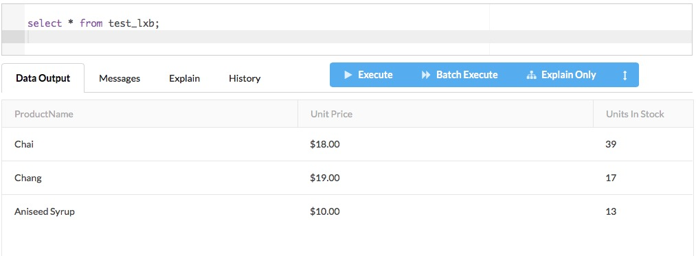

(get source)

git clone https://github.com/remyzane/esql.git

(in esql directory)

git submodule init libs/EsqlParser/

git submodule update

(install requirements in python3)

pip3 install -r docs/requirements-prd.txt

pip3 install -r docs/requirements-dev.txt 

(Run ESql in develop mode)

python3 scripts/assistant_dev.py code

http://localhost:8000/

